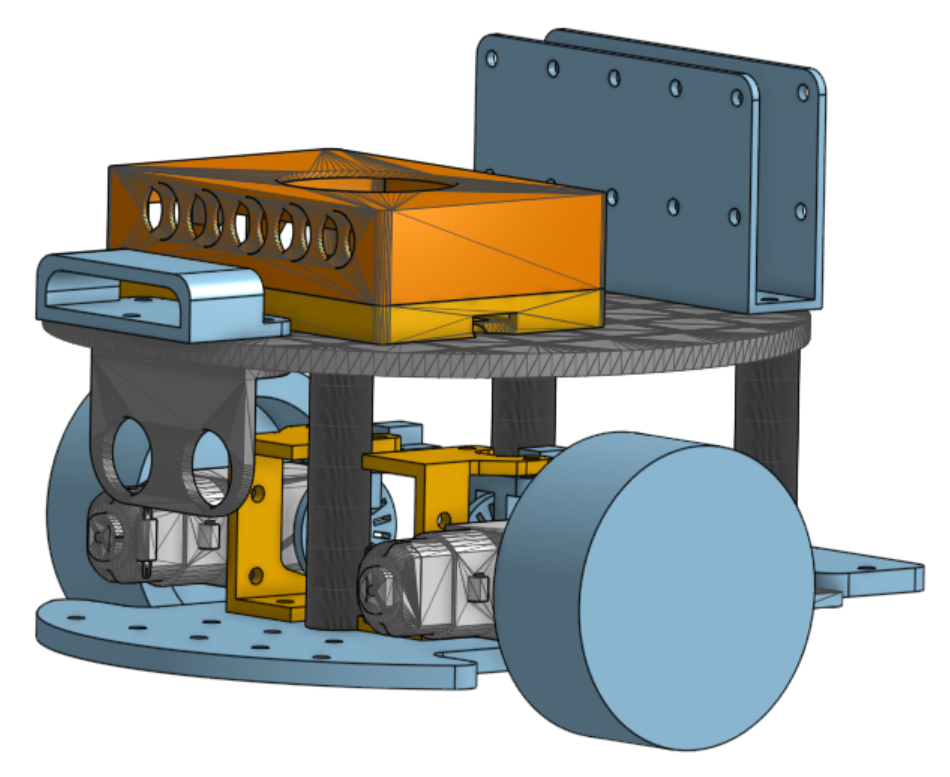
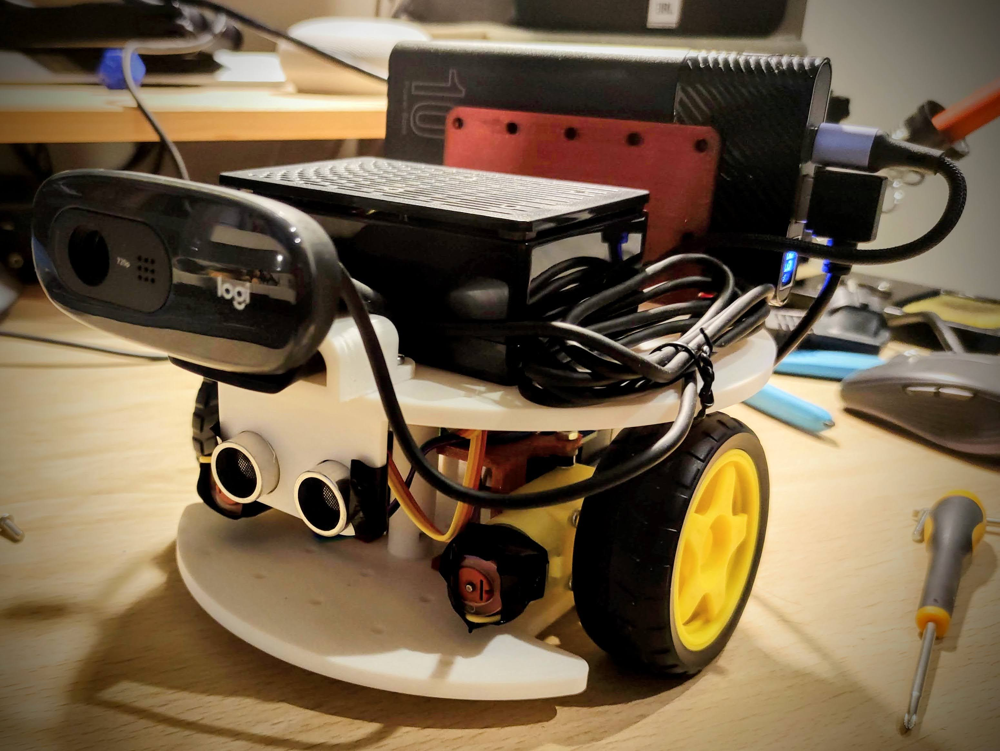

# MiniBot

MiniBot is a easy to mount and moderately cheap robot platform for learning and prototyping in robotics. It is designed to be simple to assemble and use, making it ideal for beginners and hobbyists.

## Construction

To construct the MiniBot, you will need to print the 3D parts available in the [parts](parts) directory. The parts are designed to be printed using a standard FDM 3D printer with PLA.

# Bill of Materials (BOM)

| Item | Qty | Approx. price (EUR) | Notes |
|---|---:|---:|---|
| 3D-printed parts | — | — | See `parts/` directory for STLs and print settings. |
| Arduino Uno (compatible) | 1 | ~€6-20€ | Fully Uno-compatible, USB cable included. |
| Raspberry Pi 4/5 Model B (4GB/8GB) | 1 | ~€60-120€ | Good value & widely available. |
| Adafruit Motor Shield v1 compatible | 1 | ~€4 | v1 compatible shields can be found at Aliexpress and similar. |
| TT motors with wheels (pair) | 1 set | ~€8 | Consider better motors |
| TT wheel encoders (pair) | 1 set | ~€6 | Discs + accessories; pair with IR sensors as needed. |
| Caster wheel | 1 | ~€3 | Any 10–20 mm low-profile caster works. |
| Ultrasonic sensor (HC-SR04) | 1 | ~€2–€6 | Multipacks are cheaper per unit. |
| Webcam (Logitech C270) | 1 | ~€25–€30 | 720p is enough for vision demos. |
| Battery pack for motors | 1 | ~€4–€7 | Option A (4×AA, 6 V) or Option B (6×AA, 9 V). Use quality NiMH cells. |
| Power bank for Raspberry Pi (5 V USB) | 1 | ~€22–€30 | ≥10 000 mAh works; 20 000 mAh gives longer runtime. |
| M3 screws, nuts, spacers | Varies | ~€5–€10 | from 5m to 30m length |

---

**Rough total** 
~€150-210€, excluding 3D prints and AA cells but including Raspberry Pi and many components that you may already have.

### Assembly

There are no detailed assembly instructions yet, but the design is intended to be intuitive. Look at the following images for guidance:

## Software
The software for the MiniBot robot is divided in two parts: the Arduino code and the Raspberry Pi code. The communications between the two parts is done using serial communication (USB).

### Arduino Code
The Arduino code is responsible for controlling the motors and reading the sensors. It can be found in the [arduino](arduino) directory. To upload the code to your Arduino board, open the `firmware.ino` file in the Arduino IDE and upload it to your board.

### Raspberry Pi Code
The Raspberry Pi code is responsible for higher-level functions such as image processing and navigation. A ROS2 package is available in this repository. To use it, you will need to have ROS2 installed on your Raspberry Pi. ROS2 Jazzy has been the one used for testing, but other versions may work as well.

There is another repository with the MiniBot description available at [https://github.com/narcispr/mini_bot_description](https://github.com/narcispr/mini_bot_description).

## To be done

- [ ] MiniBot power is divided in two sources: one for the motors and another for the Raspberry Pi. A better power management system is needed.
- [ ] The HMC5883L magnetometer is not yet working properly. It needs to be fixed or replaced.
- [ ] TT motors are not very accurate. Better motors with encoders would improve the performance of the robot.
- [ ] The caster wheel is not standardized. A better solution is needed.
- [ ] ROS2 package needs to be improved and documented. 