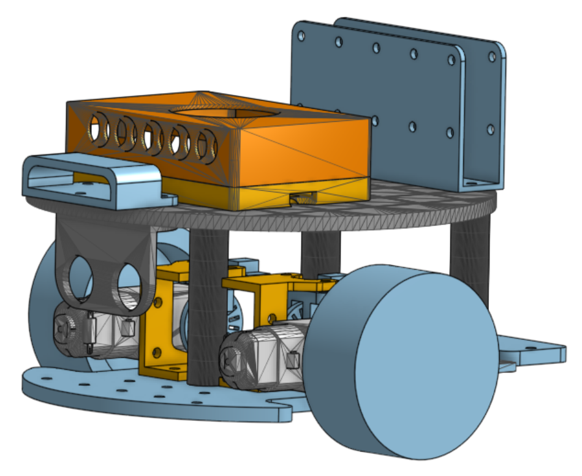
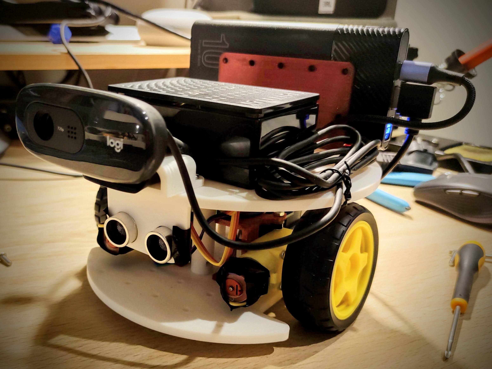

# MiniBot

MiniBot is a easy to mount and moderately cheap robot platform for learning and prototyping in robotics. It is designed to be simple to assemble and use, making it ideal for beginners and hobbyists.

## Construction

To construct the MiniBot, you will need to print the 3D parts available in the [parts](parts) directory. The parts are designed to be printed using a standard FDM 3D printer with PLA.




# Bill of Materials (BOM)


| Item | Qty | Approx. price (EUR) | Notes |
|---|---:|---:|---|
| 3D-printed parts | — | — | See `parts/` directory for STLs and print settings. |
| Arduino Uno (compatible) | 1 | ~€6-20€ | Fully Uno-compatible, USB cable included. |
| Raspberry Pi 4/5 Model B (4GB/8GB) | 1 | ~€60-120€ | Good value & widely available. |
| Adafruit Motor Shield v1 compatible | 1 | ~€4 | v1 compatible shields can be found at Aliexpress and similar. |
| TT motors with wheels (pair) | 1 set | ~€8 | Consider better motors |
| TT wheel encoders (pair) | 1 set | ~€6 | Discs + accessories; pair with IR sensors as needed. |
| Caster wheel | 1 | ~€3 | Any 10–20 mm low-profile caster works. |
| Ultrasonic sensor (HC-SR04) | 1 | ~€2–€6 | Multipacks are cheaper per unit. |
| Webcam (Logitech C270) | 1 | ~€25–€30 | 720p is enough for vision demos. |
| Battery pack for motors | 1 | ~€4–€7 | Option A (4×AA, 6 V) or Option B (6×AA, 9 V). Use quality NiMH cells. |
| Power bank for Raspberry Pi (5 V USB) | 1 | ~€22–€30 | ≥10 000 mAh works; 20 000 mAh gives longer runtime. |
| M3 screws, nuts, spacers | Varies | ~€5–€10 | from 5m to 30m length |

---

**Rough total** 
~€150-210€, excluding 3D prints and AA cells but including Raspberry Pi and many components that you may already have.

### Assembly

There are no detailed assembly instructions yet, but the design is intended to be intuitive. Look at the following images for guidance:




## Software
The software for the MiniBot robot is divided in two parts: the Arduino code and the Raspberry Pi code. The communications between the two parts is done using serial communication (USB).

### Arduino Code
The Arduino code is responsible for controlling the motors and reading the sensors. It can be found in the [arduino](arduino) directory. To upload the code to your Arduino board, open the `firmware.ino` file in the Arduino IDE and upload it to your board.

### Raspberry Pi Code
The Raspberry Pi code is responsible for higher-level functions such as image processing and navigation. A ROS2 package is available in this repository. To use it, you will need to have ROS2 installed on your Raspberry Pi. ROS2 Jazzy has been the one used for testing, but other versions may work as well.

There is another repository with the MiniBot description available at [https://github.com/narcispr/mini_bot_description](https://github.com/narcispr/mini_bot_description).

### ROS dependencies

Install the package dependencies from the workspace root:

```bash
cd ~/ros2_ws
rosdep install --from-paths src --ignore-src -r -y
```

For OctoMap support on ROS 2 Jazzy, install:

```bash
sudo apt update
sudo apt install ros-jazzy-octomap-server
```

Optional RViz plugins for visualizing OctoMap messages:

```bash
sudo apt install ros-jazzy-octomap-rviz-plugins
```

If the USB camera node is enabled in `launch/mini_bot.launch.py`, also install:

```bash
sudo apt install ros-jazzy-usb-cam
```

Build and source the workspace after installing dependencies:

```bash
cd ~/ros2_ws
colcon build --packages-select mini_bot
source install/setup.bash
```

### Running with OctoMap Server

`launch/run_robot.launch.py` starts the MiniBot nodes, `robot_state_publisher`, and `octomap_server`. The OctoMap server consumes the MiniBot ultrasonic point cloud:

- input topic: `/range_pointcloud`
- OctoMap subscription: `cloud_in`, remapped to `/range_pointcloud`
- sensor frame: `range_link`
- fixed map frame: `odom`
- resolution: `0.05` m
- maximum sensor range: `3.0` m

Run it with:

```bash
ros2 launch mini_bot run_robot.launch.py
```

The required TF chain is:

```text
odom -> base_link -> range_link
```

`navigation_node` publishes `odom -> base_link`, and `robot_state_publisher` publishes `base_link -> range_link` from the URDF in `mini_bot_description`.

Useful checks:

```bash
ros2 topic info /range_pointcloud
ros2 run tf2_ros tf2_echo odom range_link
ros2 topic echo /projected_map --once
```

The most useful OctoMap outputs are:

- `/projected_map`: 2D occupancy grid projection.
- `/octomap_binary`: compact 3D OctoMap.
- `/octomap_full`: full 3D OctoMap.

### Magnetometer calibration

The robot can use the magnetometer heading as an external orientation source by setting:

```yaml
navigation_node:
  ros__parameters:
    use_external_theta: True
```

There are two simple calibration layers:

1. `mini_bot_node` corrects the raw X/Y magnetometer readings before publishing `/compass_angle`.
2. `navigation_node` maps measured headings to robot-relative headings with `external_theta_calibration_lut`.

#### Automatic raw X/Y calibration

The `mini_bot_node` provides a service that rotates the robot, records magnetometer min/max values, updates the raw X/Y calibration parameters, and writes them back to `config/mini_bot.yaml`.

For calibration, first run with the compass disabled in `config/mini_bot.yaml`:

```yaml
navigation_node:
  ros__parameters:
    use_external_theta: False
```

Start the robot on a flat surface with enough free space to rotate:

```bash
ros2 launch mini_bot run_robot.launch.py
```

Call the service:

```bash
ros2 service call /calibrate_magnetometer std_srvs/srv/Trigger
```

By default, the robot commands `1.0 rad/s` for `10 s` on `/cmd_vel`. The service saves:

```yaml
mag_x_offset_uT
mag_y_offset_uT
mag_x_scale
mag_y_scale
```

The service also reports the observed X/Y/Z ranges. After calibration, restart the robot. Then enable `use_external_theta: True` and tune the heading LUT below so the robot's initial forward direction maps to `0` degrees.

The service parameters are:

```yaml
mini_bot_node:
  ros__parameters:
    mag_calibration_angular_velocity: 1.0
    mag_calibration_duration_sec: 10.0
    mag_calibration_config_file: "/home/narcis/ros2_ws/src/mini_bot/config/mini_bot.yaml"
```

#### Manual raw X/Y calibration

Use this when `/compass_angle` does not cover the full `0..360` range, for example when it moves from `180` to `300` and then goes back to `180`. This usually means the X/Y magnetic readings are offset or stretched.

Start the robot, then rotate it slowly through one full turn while watching `/imu/mag`:

```bash
ros2 topic echo /imu/mag
```

Record the minimum and maximum `magnetic_field.x` and `magnetic_field.y` values. The topic is in Teslas, while the YAML parameters below are in microteslas, so multiply the values by `1e6`.

Calculate:

```text
x_offset = (x_max + x_min) / 2
y_offset = (y_max + y_min) / 2

x_radius = (x_max - x_min) / 2
y_radius = (y_max - y_min) / 2
avg_radius = (x_radius + y_radius) / 2

mag_x_scale = avg_radius / x_radius
mag_y_scale = avg_radius / y_radius
```

Then set these parameters in `config/mini_bot.yaml`:

```yaml
mini_bot_node:
  ros__parameters:
    mag_x_offset_uT: 0.0
    mag_y_offset_uT: 0.0
    mag_x_scale: 1.0
    mag_y_scale: 1.0
    mag_heading_offset_deg: 0.0
```

`mag_heading_offset_deg` is a final constant angle offset. Use it if the heading covers the full circle but `0` degrees does not match the robot's forward direction.

#### Robot heading LUT

After the raw X/Y calibration, measure four stable headings with the robot pointing forward, left, backward and right. Put the measured value first, then the corrected robot-relative heading:

```yaml
navigation_node:
  ros__parameters:
    use_external_theta: True
    external_theta_calibration_lut:
      - 40.0
      - 0.0
      - 150.0
      - 90.0
      - 280.0
      - 180.0
      - 355.0
      - 270.0
```

The LUT is circular, so it can handle the `360 -> 0` wraparound.

#### Sensor orientation

ROS `base_link` convention is:

```text
X forward, Y left, Z up
```

If the magnetometer is mounted with sensor `Y` pointing forward, sensor `X` pointing right, and `Z` pointing up, the mounting is usable, but it is rotated relative to `base_link`. With the current heading formula this is typically equivalent to a `-90` degree correction, so you can use:

```yaml
mag_heading_offset_deg: 270.0
```

If your four-point heading LUT already maps forward to `0`, left to `90`, backward to `180`, and right to `270`, that LUT can absorb this offset too.

Many GY-271 boards are sold with different chips. The Arduino firmware currently uses the `Adafruit_HMC5883_U` library. If an I2C scanner finds the sensor at `0x0D` instead of `0x1E`, the board is probably QMC5883L-compatible and the Arduino firmware should use a QMC5883L library instead.

## To be done

- [ ] MiniBot power is divided in two sources: one for the motors and another for the Raspberry Pi. A better power management system is needed.
- [ ] The HMC5883L magnetometer is not yet working properly. It needs to be fixed or replaced.
- [ ] TT motors are not very accurate. Better motors with encoders would improve the performance of the robot.
- [ ] The caster wheel is not standardized. A better solution is needed.
- [ ] ROS2 package needs to be improved and documented. 
